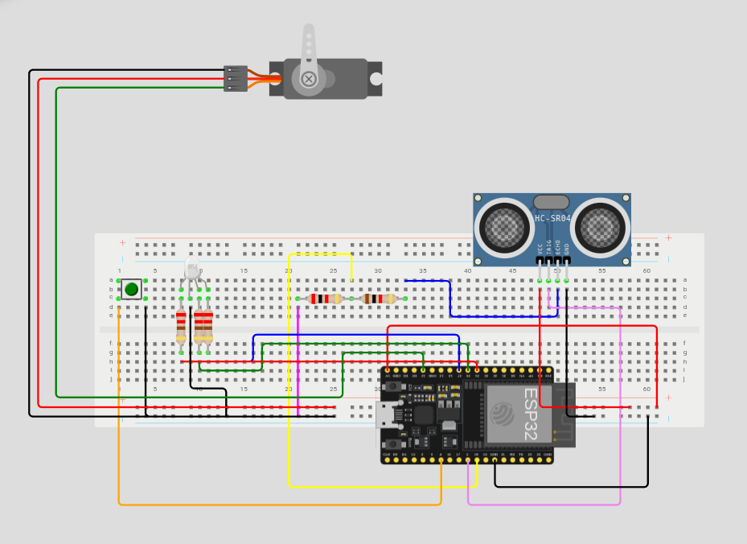
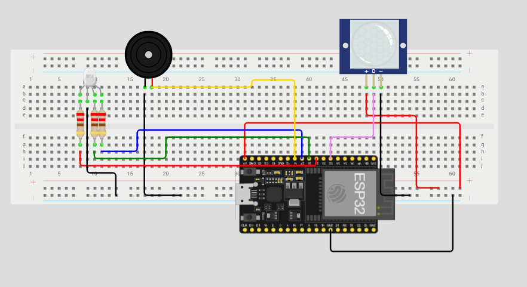

# IoT Dual-Node Challenge — Distributed Alarm System

Two wirelessly-linked IoT nodes with a live dashboard for observation, control and history.

**Branch `v2.0`.** Adds remote commands with two-stage acknowledgements, controllable variables on
both nodes, an ESP-NOW heartbeat from node_a to node_b, MQTT Last Will, and a SQLite history. The
branch `main` holds the version verified on hardware on 8 October, without commands.

What has been checked, and how, is in [Verification](#verification). In short: the firmware of
both nodes compiles; the command parser, the platform and the dashboard pass automated tests; the
v2.0 firmware **has not yet run on the boards**.

---

## What this is

A distributed alarm and access controller made of two nodes that talk to each other directly over
ESP-NOW, plus a platform that lets a human watch both of them live, change their settings, and
review what happened.

| | **node_a — Room** | **node_b — Door** |
|---|---|---|
| MCU | ESP32 DevKitC (ESP-WROOM-32) | ESP32 DevKitC (ESP-WROOM-32) |
| MAC | `78:42:1c:68:44:98` | `f4:65:0b:c0:e0:a4` |
| Sensor | PIR HC-SR501 — motion inside | HC-SR04 — distance at the door |
| Input | — | access switch (3-pin, two pins used) — the credential |
| Actuator | active buzzer — alarm | RGB LED — door state |
| Status indicator | RGB LED | RGB LED |
| Radio | ESP-NOW (peer) + Wi-Fi (MQTT) | ESP-NOW (peer) + Wi-Fi (MQTT) |

In one sentence: with access closed, motion in the room makes node_a sound its buzzer and turns
node_b's LED to blinking red, until someone turns the access switch on at the door.

### Why two identical ESP32s

Both boards carry their own radio, so each node is an independent MQTT client and the dashboard
reaches either one directly, neither node depends on the other to be visible. The wire format and
the command parser live in an ESP-IDF component shared by both projects.

---

## Technology stack

Everything on the microcontroller is ESP-IDF. The communication layer uses the native Espressif
APIs directly.

| Layer | Technology | Why this one |
|---|---|---|
| Firmware | **C++17 on ESP-IDF v5.5.5** | Native Espressif framework |
| Build | **CMake + Ninja**, driven by `idf.py` | ESP-IDF's own build system |
| Code sharing | **ESP-IDF components** via `EXTRA_COMPONENT_DIRS` | `shared/core` and `shared/net` are compiled into both node projects |
| Node ↔ node | **ESP-NOW** (`esp_now`, unicast, registered peer) | Connectionless, no broker, no IP; hardware delivery ACK |
| Wi-Fi | **`esp_wifi`** station mode, brought up explicitly | Init order is `nvs_flash` → `esp_netif` → `esp_event` → `esp_wifi` → `esp_now` |
| Node ↔ platform | **`esp-mqtt`** to a **Mosquitto** broker | Event-driven client, automatic reconnection, Last Will |
| Wire format, node ↔ node | **Packed binary struct**, 10 bytes | Compact on a constrained link, explicit byte layout |
| Wire format, node ↔ platform | **JSON** — state QoS 0, commands and acks QoS 1 | Human-readable, inspectable live with `mosquitto_sub` |
| Command parsing on the node | Hand-written parser in `shared/core/command.cpp` | One flat object with three fields; no library to explain, every rule tested |
| Platform server | **Python 3 · Flask · Flask-SocketIO · paho-mqtt** | Stack easy to build, and great for testing |
| Storage | **SQLite** (`platform/history.db`) | Single file, no server, queryable with plain SQL, exported as CSV |
| Dashboard | Server-rendered HTML + **Socket.IO** push, client vendored in `platform/static/` | No build step, works without internet |
| Tests | **CMake + CTest** on the host; a Python end-to-end test with simulated nodes | The parser and the platform are checked without boards |

---

## Wiring

Interactive diagram for node_b: **https://wokwi.com/projects/477329946358273025**



Interactive diagram for node_a: **https://wokwi.com/projects/477331000260311041**



### Pin map — node_a (room)

| Signal | GPIO | How it is wired |
|---|---|---|
| PIR `OUT` | 32 | direct, internal pull-down. The HC-SR501 output is already 3.3 V — no divider. Jumper on **H** (repeat trigger) |
| PIR `VCC` / `GND` | — | 5 V and GND from the ESP32 board |
| Buzzer `+` | 14 | active buzzer straight off the pin, **no series resistor**: a 220 Ω resistor silenced it. `−` to GND |
| RGB LED R / G / B | 25 / 26 / 27 | 220 Ω in series per colour, common cathode to GND |

### Pin map — node_b (door)

| Signal | GPIO | How it is wired |
|---|---|---|
| HC-SR04 `TRIG` | 5 | direct. 3.3 V is enough to trigger the burst |
| HC-SR04 `ECHO` | 18 | **through a 1 kΩ / 2 kΩ divider** |
| HC-SR04 `VCC` / `GND` | — | 5 V and GND from the ESP32 board, ~15 mA |
| Access switch | 4 | 3-pin switch: middle pin to GPIO 4, one outer pin to GND, the other unused. Internal pull-up, **no external resistor**. On reads 0 |
| RGB LED R / G / B | 25 / 26 / 27 | 220 Ω in series per colour, common cathode to GND |

Pins deliberately avoided: 0, 2, 12 and 15 are strapping pins whose level at power-up selects
the boot mode; 6–11 are wired to the module's internal SPI flash; 1 and 3 are UART0 and carry the
serial console.

---

## Behavior

The two nodes cooperate over ESP-NOW, with no platform involved. The platform watches and changes
settings; it is never in the path of an alarm.

| node_b switch | node_a | node_b |
|---|---|---|
| **Off** — access closed (default) | motion after warm-up: LED red, buzzer sounds (unless `buzzer_enabled` = 0), sends `MotionStarted` once per rising edge | LED red; yellow when something is between 4 cm and `near_cm` |
| Off, after `MotionStarted` arrives | — | **LED blinks red until the switch is turned on** |
| **On** — access open | **LED blue, buzzer silent, no alarm** | LED green; clears any alert |

node_a's LED outside an alarm is yellow during the PIR warm-up (`warmup_s`, 60 s by default) and
green once the sensor can be trusted. node_a never raises the alarm during warm-up: the HC-SR501
fires on its own while its pyroelectric element settles.

**The headline interaction:** with access closed, one gesture in front of node A and two boards
react at once — node A sounds its buzzer, node B goes red — over ESP-NOW, with no platform
involved. Turning the switch on is the acknowledgement: node B clears the alert and node A goes
blue.

### Loss of communication and safe behaviour

Each failure is detected by the side that suffers it, and each one ends in the safe state.

| What is lost | Who detects it, and how | What the node does |
|---|---|---|
| node_b, seen from node_a | access lease: node_b repeats its access state every `repeat_ms`; node_a counts access as open only while an `AccessOpen` from the last 3 s backs it | **stays armed**. A dead node_b, a lost `AccessClosed` or a broken link can never disarm the room. Reports `"peer":false` |
| node_a, seen from node_b | heartbeat: node_a sends an ESP-NOW heartbeat every second; 3 s of silence means the link is lost | **LED blue**: the room is no longer watched, and the door says so. An alert already raised stays (red blinking has priority). Reports `"peer":false` |
| either node, seen from the platform | silence: no state report for 3 s | dashboard marks it **offline**, greys out its card, logs the event; commands to it time out |
| either node, seen from the broker | MQTT Last Will: the broker publishes `offline` on `ilu/<node>/status` after 1.5 × the 5 s keepalive | dashboard shows the broker's verdict too; a second, independent detector |
| the platform | — | the nodes keep cooperating over ESP-NOW; MQTT publishes are skipped until it returns |

---

## Remotely controllable variables

Three per node; one of them exists on both so it can be set on both at once.

| Variable | Node | Range | Default | Effect |
|---|---|---|---|---|
| `buzzer_enabled` | A | 0 – 1 | 1 | 0 = silent alarm: LED red and node_b alerted, no sound |
| `warmup_s` | A | 0 – 300 | 60 | PIR warm-up |
| `near_cm` | B | 5 – 100 | 15 | upper edge of the "near" window (the lower edge is fixed at 4 cm) |
| `repeat_ms` | B | 200 – 1000 | 1000 | access-state repeat to node_a. Capped at 1 s so three repeats fit in node_a's 3 s lease |
| `publish_ms` | A and B | 250 – 2000 | 1000 | state report period. Capped at 2 s so the platform's 3 s offline rule still holds |

**The node is the authority.** The platform does not check ranges: it forwards whatever the user
types, and the node accepts or rejects it. Every rejection on screen is the node's own answer.
Values live in RAM and return to the defaults on reboot; the dashboard shows that, because it
displays what the node reports, not what was sent.

Fixed in the firmware: node_a's access lease (3 s), the peer timeout (3 s), the heartbeat period
(1 s), and the 4 cm lower edge of the near window.

---

## Commands and acknowledgements

### MQTT topics

| Topic | Direction | QoS | Payload |
|---|---|---|---|
| `ilu/<node>/state` | node → platform | 0 | full state, every `publish_ms` and at once on any change |
| `ilu/<node>/cmd` | platform → one node | 1 | `{"id":"143005-12","var":"near_cm","value":20}` |
| `ilu/all/cmd` | platform → both nodes | 1 | same; both nodes are subscribed, so one publish reaches both at once |
| `ilu/<node>/ack` | node → platform | 1 | see below |
| `ilu/<node>/status` | node / broker → platform | 1, retained | `online` from the node on connect; `offline` from the broker as Last Will |

```
ilu/a/state {"node":"a","up":26480,"warm":true,"motion":false,"alarm":false,"buzzer":0,"access":false,"peer":true,"led":"green","buzzer_enabled":1,"warmup_s":60,"publish_ms":1000}
ilu/b/state {"node":"b","up":26700,"cm":40,"near":false,"access":false,"alert":false,"peer":true,"led":"red","near_cm":15,"repeat_ms":1000,"publish_ms":1000}
```

`led` is one of `off`, `red`, `yellow`, `green`, `blue`, `red_blink`. `buzzer` is read back from
the pin, not taken from the code's intention.

### Two acknowledgements per command

Requirement #6 asks for confirmation of reception **and** of execution, so each node answers
twice:

```
ilu/b/ack {"node":"b","id":"143005-12","var":"near_cm","stage":"received"}
ilu/b/ack {"node":"b","id":"143005-12","var":"near_cm","stage":"applied","value":20}
```

or, for a value the node refuses:

```
ilu/b/ack {"node":"b","id":"143005-13","var":"near_cm","stage":"rejected","reason":"out of range","value":20}
```

1. **Received** is sent by the MQTT task as soon as the payload parses. A payload that does not
   parse is answered there with `rejected` and the parser's reason (`missing value`,
   `value must be an integer`, `unknown field`, …).
2. The command then goes through a 4-slot queue to the main loop, the same pattern as the ESP-NOW
   receive path, so all control logic stays in one task. A full queue is answered `node busy`.
3. **Applied / rejected** is sent by the main loop after it checks the variable name and the
   range. `value` is the value **now in effect**: the new one, or the old one after a rejection.
4. The node's next state report carries the setting too, and the dashboard logs
   "Node reports near_cm = 20 (was 15)". That is the node's behaviour, not just its word.

The platform tracks each command per node: **pending → received → applied | rejected**, or
**timed out** after 3 s without a final answer. A late answer still updates the command, marked
as late: the node's answer wins over the platform's guess.

---

## The platform

`platform/app.py` is a single Python process. Run it on the laptop that hosts the broker.

1. **MQTT client.** Subscribes to `ilu/#`: state, acks and status.
2. **Authoritative state.** Holds the last state each node reported. Every value in the UI comes
   from a report, never from an assumption.
3. **Commands.** Publishes to `ilu/a/cmd`, `ilu/b/cmd` or `ilu/all/cmd` and tracks the answers.
4. **Socket.IO push.** Every update reaches the browser at once, without polling. A browser that
   opens late receives a full snapshot, commands included.
5. **Watchdog.** A node with no report for 3 s is marked offline; the first report afterwards
   marks it back online. `up` going backwards is shown as "Node rebooted". Commands without a
   final answer after 3 s are marked timed out.
6. **History.** Every report, event, command and ack goes to SQLite as it arrives.

### Dashboard

- Header with the broker connection status.
- Topology diagram: a dot pulses along a node's MQTT wire on each report. The ESP-NOW link is
  drawn and labelled *not seen by the platform*, because that traffic never touches the broker.
- One card per node: mirrored LED including the blink, online pill (its tooltip shows the Last
  Will status), "last report x s ago", every field including the ESP-NOW link, the **settings in
  effect as reported by the node**, a collapsible raw JSON, and for node_b a distance bar whose
  near zone follows the reported `near_cm`, with a 60 s sparkline.
- **Control panel:** target node_a / node_b / Both, variable, value, Send. Below it, the last
  commands with one chip per node: pending, received, applied with the value and the round-trip
  time, rejected with the reason and the value still in effect, or timed out.
- Event timeline with filters All / Alarm / Access / Commands / Link / Info, showing server time
  and node uptime. `near` is deliberately not a timeline event, because it flickers.
- CSV export links for the four history tables.

The server uses Werkzeug's development server, which is enough for one laptop.

### Historical data

| Table | Holds | Columns |
|---|---|---|
| `telemetry` | every state report | `ts_server`, `node`, `up_ms`, `payload` (the JSON as received) |
| `events` | every timeline entry | `ts_server`, `node`, `up_ms`, `kind`, `text` |
| `commands` | every command sent | `ts_server`, `cmd_id`, `target`, `var`, `value` |
| `acks` | every acknowledgement received | `ts_server`, `cmd_id`, `node`, `stage`, `var`, `value`, `reason` |

`commands` and `acks` join on `cmd_id`: what was asked, what each node answered, and when.
`up_ms` is the node's own clock and `ts_server` the platform's, so a row's two timestamps can be
compared. Export: `http://<laptop>:5000/export/<table>.csv`, or open the file with `sqlite3`.

---

## Not implemented

- **ESP-NOW encryption.** The only filter is the sender's MAC address.
- **Authentication on MQTT.** The broker is anonymous, no TLS — a prototype shortcut, documented
  in `platform/mosquitto/ilu.conf`.
- **Settings survive a reboot.** They live in RAM; NVS persistence was left out on purpose so a
  reboot always returns to a known state.
- **Wi-Fi power-save control.** `esp_wifi_set_ps` is not called. Modem sleep can hurt ESP-NOW
  reception; it was not a problem in the hardware tests on `main`.
- **Router-off test.** Both nodes are on the router's Wi-Fi, so ESP-NOW rides on that access
  point's channel. ESP-NOW needs no router by design, but that was not tested with the router off.

---

## Verification

| What | How | Result |
|---|---|---|
| Firmware of both nodes, v2.0 | `idf.py build` with ESP-IDF v5.5.5 | compiles with no warnings; each binary ~900 KB, 14% of the 1 MB app partition free |
| Command parser, range check, ack format | `test/test_command.cpp`, host build, CTest | all pass; a deliberately broken range check makes them fail |
| ESP-NOW frame parser | `test/test_protocol.cpp` | all pass |
| Platform end to end | `test/test_platform.py`: real broker, real `app.py`, two simulated nodes speaking the firmware's MQTT contract | 40 checks pass: commands to one node and to both, applied / rejected / timed out, platform-side input checks, silence watchdog, Last Will, peer-loss events, SQLite and CSV |
| Dashboard page logic | the page loaded in a simulated DOM (jsdom) and fed the server's events | renders state, settings, command chips and filters with no script errors. Not a visual check in a real browser |
| **v2.0 firmware on the boards** | — | **not run yet**. On `main`, everything in the Behavior table except the controllable variables, the heartbeat and the blue LED on node_b was verified on hardware on 8 October |

---

## Repository layout

```
CMakeLists.txt           host build for the pure logic — not an ESP-IDF project
CLAUDE.md                working notes for the coding assistant
docs/instructionOfUse.md demo-day command guide, in Spanish
shared/
  core/                  no ESP-IDF headers — compiles and is tested on the laptop
    CMakeLists.txt         dual mode: ESP-IDF component, or plain library for the host build
    hal.h                  IHalA / IHalB — the hardware interfaces the nodes use
    protocol.h/.cpp        10-byte Frame, MsgType, EventId, protocol_parse()
    command.h/.cpp         command parser, variable range check, ack formatting
  net/                   Wi-Fi, MQTT (state, commands, acks, Last Will), ESP-NOW queues
    secrets.h.example      template for the git-ignored secrets.h
node_a/
  main/                  main.cpp + hal_a_esp32 (PIR, buzzer, RGB LED)
node_b/
  main/                  main.cpp + hal_b_esp32 (HC-SR04, access switch, RGB LED)
platform/
  app.py                 MQTT client, state store, commands, Socket.IO, watchdog, SQLite
  templates/index.html   the dashboard page
  static/                vendored Socket.IO client
  mosquitto/ilu.conf     broker configuration
test/
  test_protocol.cpp      host tests, ESP-NOW frame parser
  test_command.cpp       host tests, command parser and range check
  test_platform.py       end-to-end platform test with its own broker
  sim_nodes.py           MQTT stand-ins for both nodes
images/                  circuit diagrams
```

The node logic lives in each `main.cpp`: read inputs, apply commands, drain the ESP-NOW queue,
decide the outputs, publish the state. There is no separate state-machine module.

`shared/core` exists so the wire formats can be exercised without a board. **If it ever fails to
compile on the host, hardware has leaked into it.**

---

## How to run it

Each node is its own ESP-IDF project. Before the first build, copy
`shared/net/secrets.h.example` to `shared/net/secrets.h` and fill in the Wi-Fi name, the password
and `MQTT_BROKER_URI`. `secrets.h` is git-ignored. `sdkconfig` is not committed either, so the
first build on a fresh clone regenerates it.

```bash
get_idf                              # export.sh is per terminal, not global

idf.py -C node_b -p /dev/serial/by-id/usb-Silicon_Labs_CP2102N_... build flash monitor
idf.py -C node_a -p /dev/serial/by-id/usb-Silicon_Labs_CP2102_...  build flash monitor
```

Always address the boards by their `/dev/serial/by-id/` path. The `ttyUSB0` / `ttyUSB1` numbers
are assigned in plug order and swap between sessions, and flashing the wrong board is silent.

| Role | Adapter | MAC |
|---|---|---|
| node_a — Room | CP2102, serial `0001` | `78:42:1c:68:44:98` |
| node_b — Door | CP2102N, serial `7a041be6…` | `f4:65:0b:c0:e0:a4` |

The nodes have the broker's address compiled in. If the laptop's IP changes, the nodes still join
Wi-Fi but never reach the broker, and the dashboard marks them offline. Reserve the address in the
router, or change `MQTT_BROKER_URI` and reflash both nodes.

**Broker.** Install `platform/mosquitto/ilu.conf` into `/etc/mosquitto/conf.d/` and restart
Mosquitto. Watch the raw traffic, or send a command by hand:

```bash
mosquitto_sub -h <broker-ip> -t 'ilu/#' -v
mosquitto_pub -h <broker-ip> -t ilu/all/cmd -m '{"id":"manual-1","var":"publish_ms","value":500}'
```

**Dashboard.**

```bash
python3 -m venv platform/.venv
platform/.venv/bin/pip install -r platform/requirements.txt
ILU_BROKER=localhost platform/.venv/bin/python platform/app.py
# open http://localhost:5000, or http://<laptop-ip>:5000 from another device on the LAN
```

**Tests.**

```bash
cmake -S . -B build-host && cmake --build build-host
ctest --test-dir build-host --output-on-failure

platform/.venv/bin/pip install "python-socketio[client]" amqtt
platform/.venv/bin/python test/test_platform.py
```

**Back to the verified version.** `git switch main`, reflash both nodes and restart `app.py`.

The full demo-day command list, in Spanish, is in `docs/instructionOfUse.md`.

---

## Mandatory requirements

| # | Requirement | How it is met | Status |
|---|---|---|---|
| 1 | Two independent devices, own MCU, C/C++ | two ESP32 boards, C++17 on ESP-IDF | done |
| 2 | Each node: ≥1 sensor and ≥1 actuator with observable output | node_a: PIR + buzzer and LED. node_b: HC-SR04 + LED | done, verified on hardware |
| 3 | Wireless node-to-node, ≥1 interaction without the platform | motion alert A→B and access state B→A over ESP-NOW | done, verified on hardware |
| 4 | Platform: view both nodes; command one node; command both | live dashboard; `ilu/<node>/cmd`; one publish on `ilu/all/cmd` | view verified on hardware; commands tested end to end with simulated nodes |
| 5 | ≥2 remotely controllable variables per node | three per node, see the table above | implemented, compiled, tested against simulated nodes |
| 6 | Confirm reception **and** execution; show the state the node reports | `received` then `applied`/`rejected` with the value in effect; settings carried in every state report | implemented, compiled, tested against simulated nodes |
| 7 | Detect loss of communication, show it, define safe behaviour | access lease, A→B heartbeat, platform watchdog, MQTT Last Will; safe states in the table above | lease and watchdog verified on hardware; heartbeat and Last Will compiled and tested with simulated nodes |
| 8 | Able to explain the data and command flow | this README | — |

Optional items also covered: message validation (both parsers reject anything malformed, and the
nodes only accept ESP-NOW frames from their peer's MAC), history of readings and commands, alarm
notifications on the dashboard, automatic reconnection (Wi-Fi, MQTT, platform to broker).

---

## Author

Hugo Daniel Castillo Ovando — Robotics and Digital Systems Engineer
